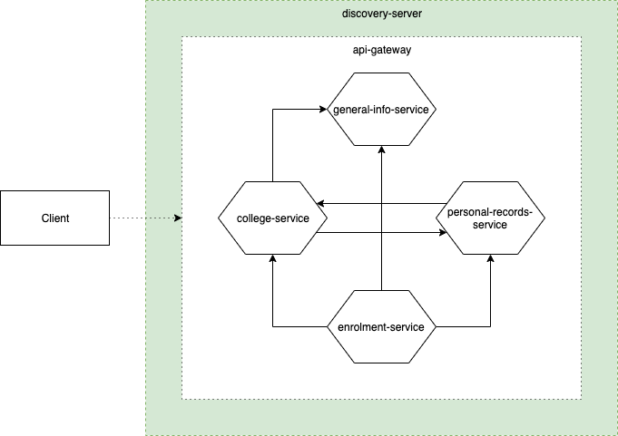

# 1. Overview
The discovery-server maintains a service registry for services under the same network. Services register to it, and become known and available within the network under its application name.

The purpose of the discovery-server is to address the dynamic IP to which services are registered in modern applications, and the ever-present possiblity of scaling into more instances of the application. This is achieved by using [Netflix's Eureka](https://cloud.spring.io/spring-cloud-netflix/multi/multi_spring-cloud-eureka-server.html), following the [Client-side Service Discovery Pattern](https://microservices.io/patterns/client-side-discovery.html) of Microservices patterns.   

