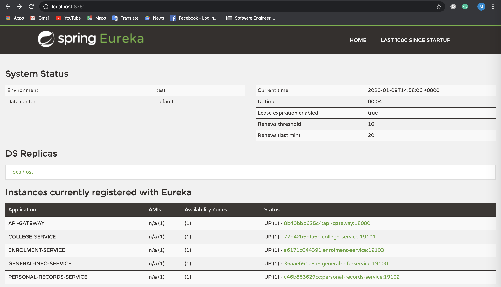

# 1. Overview
The discovery-server maintains a service registry for services under the same network. Services register to it, and become known and available within the network under its application name.

The purpose of the discovery-server is to address the dynamic IP to which services are registered in modern applications, and the ever-present possiblity of scaling into more instances of the application. This is achieved by using [Netflix's Eureka](https://cloud.spring.io/spring-cloud-netflix/multi/multi_spring-cloud-eureka-server.html), following the [Client-side Service Discovery Pattern](https://microservices.io/patterns/client-side-discovery.html) of Microservices patterns.   


# 2. Service Registry
Upon starting a service, it automatically attempts to register itself to the service registry of the discovery-server. This could take a fair amount of time, and attempting to request from an unavailable service will result into the following error message.
```json
curl http://localhost:18000/api/v1/college

{
    "timestamp": "2020-01-09T14:54:47.517+0000",
    "path": "/api/v1/college",
    "status": 503,
    "error": "Service Unavailable",
    "message": "Unable to find instance for college-service",
    "requestId": "04dd5e89"
}
```

Just like the api-gateway, the discovery-server is exposed. This is for the developers to check which services have successfully registered themselves to the Eureka discovery-server. To check for the service registry, access `http://localhost:8761` from the browser.
